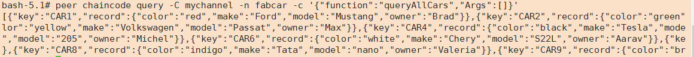
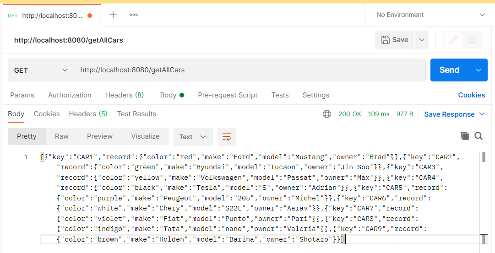

# java_connect_fabric2.2
java连接 fabric2.2 网络并调用 fabcar 的java链码

update:2021/08/06

# Java_To_Fabric

本项目为fabric-sdk-java 2.2 连接 fabric 2.2 网络并调用fabcar的java链码的查询方法的简单demo

## 一、基础准备

### 1.1 项目版本

​	`fabric 2.2`

​	`fabric-sdk-java 2.2 `

​	`fabric-gateway-java 2.1`

​	`java 8`


### 1.2 本项目需要fabric网络的成功运行作为基础，并且能够在fabric网络上进行链码操作

如：fabric-samples中的fabcar链码的queryAllCars方法的查询结果如下



(若无法完成该部分工作，建议先学会fabric2.2网络的基本部署。)

B站学习资源：

​      总时长：1小时左右

​      效果：该up主讲解清晰友好，且后续会有fabric链码和go-sdk内容的推出

[手动搭建hyperledger fabric v2.x 网络](https://www.bilibili.com/video/BV1EK411F7zM)


### 1.3 项目目录解读

```yaml
------java_to_fabric           #springboot
     |
------twonodes                 #fabric 网络
     |
       ----chaincode           #链码存放路径
       ----channel-artifacts   #创始块、通道配置文件、锚节点配置文件
       ----crypto-config       #组织的证书材料
       ----configtx.yaml       #生成创始块、通道配置和锚节点配置的配置文件(结合configtxgen使用)
       ----crypto-config.yaml  #生成组织的证书材料的配置文件(结合cryptogen命令使用)
       ----docker-compose.yaml #启动fabric网络时用到的配置文件
```


### 1.4 注意事项

(1) 使用java链码时建议先拉取java链码运行环境

`docker pull hyperledger/fabric-javaenv:2.2`

(2) java链码打包时应写绝对路径。如下所示：

peer lifecycle chaincode package fabcar.tar.gz \
  --path /opt/gopath/src/github.com/hyperledger/fabric-cluster/chaincode/java/build/install/fabcar \
  --lang java \
  --label fabcar_1


## 二、springboot项目运行及结果

​	使用 Idea 打开java_to_fabric 项目

​	将 config/connection.yaml 中对应的 ip 改为自己部署fabric网络的机器的ip地址，如果使用自己的证书及私钥记得将对应文件夹进行替换且核查项目中使用到的路径是否与自己替换后的路径一致

​	启动项目成功后访问  `http://localhost:8080/getAllCars` ，结果图如下




## 三、Fabric测试

推荐使用Caliper


## 参考资料

[1] https://github.com/hyperledger

[2] https://hyperledger-fabric.readthedocs.io/zh_CN/release-2.2/

[3] https://space.bilibili.com/373566326/

[4] https://www.jianshu.com/p/26a031dd234d
